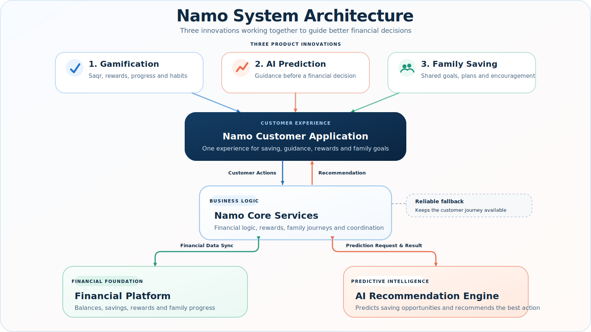

# Namo

> A proactive financial companion that turns saving into an engaging habit, guides spending decisions before they happen, and brings families closer to shared goals.

## The Problem

Traditional banking applications are strongest after money has already been spent. They show balances and transaction history, but offer limited motivation to save, limited guidance before the next purchase, and few reasons for families to build financial habits together.

Customers need more than another dashboard. They need immediate emotional feedback, relevant guidance at the moment of decision, and a shared experience that makes long-term progress feel achievable.

## The Solution

Namo combines three connected experiences:

1. **Gamification** makes progress visible and emotionally rewarding.
2. **AI Prediction** evaluates whether waiting for a likely merchant opportunity could save more than buying today.
3. **Family Saving** turns individual intentions into shared goals and coordinated action.

Together, these experiences help customers build healthier habits before spending happens—not simply review it afterward.

## Why Banks Need This

Namo gives banks a positive reason to engage customers between transactions. Instead of relying on generic campaigns or passive financial summaries, banks can support timely decisions, reinforce saving behavior, and create more relevant customer interactions.

The result is a stronger everyday relationship: customers return to care for progress, review personalized opportunities, contribute to family goals, and celebrate better financial choices.

## Three Core Innovations

### 1. Gamification

Saving usually offers a delayed reward. Namo makes that reward visible today through Saqr, a virtual companion whose health, mood, and evolution respond to positive financial behavior.

Every contribution becomes meaningful feedback. Customers see progress, receive encouragement, earn rewards, and watch Saqr grow as their saving habit becomes stronger. NXP, Akthr points, and cashback remain separate reward types, each supporting a clear role in the experience.

This is not a virtual pet added beside a banking product. Saqr is the emotional interface for financial progress: it turns an abstract balance into a relationship customers want to maintain. Emergency protection also prevents a necessary withdrawal from feeling like personal failure.

By shortening the emotional distance between today's action and tomorrow's goal, Namo encourages repeat engagement and helps consistent saving become a habit.

### 2. AI Prediction

Namo does not simply recommend products or display a generic merchant list. It estimates whether waiting for a possible future merchant opportunity could create greater savings than purchasing today.

Before presenting guidance, the AI Recommendation Engine evaluates the predicted likelihood of an opportunity, the customer's likelihood of purchasing, estimated savings, budget relevance, recent behavior, previous decisions, and essential-spending safeguards.

It then recommends one clear action: wait, buy now, or treat the opportunity as not relevant. These recommendations are probabilistic, and Namo never presents a future promotion as guaranteed.

For banks, this creates a more useful moment of engagement. A relevant recommendation can strengthen trust, improve campaign relevance, and help customers associate the bank with better decisions—not only completed transactions.

### 3. Family Saving

Namo makes saving collaborative through shared goals, contribution planning, progress visibility, and parent-to-child rewards.

Each family member can understand how their contribution supports the goal while parents coordinate a realistic plan. Encouragement and rewards turn the goal into a shared commitment rather than an isolated balance.

This social layer creates accountability and continuity. Families have more reasons to return, celebrate progress together, and maintain the saving journey over time.

## Judge Demonstration Flow

1. Activate a personal saving goal and make a contribution.
2. Show Saqr's immediate health, mood, and evolution response.
3. Review the distinct NXP, Akthr, and cashback reward experiences.
4. Open Saving Opportunities and request a personalized prediction.
5. Explain why Namo recommends waiting, buying today, or ignoring the opportunity.
6. Open the family goal and generate a contribution plan.
7. Switch to the parent role and send a family reward.
8. Return to Rashid's account to show the notification and shared celebration.
9. Reset the complete journey from the Cheat Controller for the next demonstration.

## System Architecture



The three product innovations come together in one customer experience. Customer actions flow to Namo Core Services, which coordinates financial logic, rewards, family journeys, notifications, and business rules. Core Services keeps the Financial Platform synchronized and requests personalized guidance from the AI Recommendation Engine when needed. The engine returns its prediction to Core Services, which turns it into a clear recommendation and delivers it back to the customer.

## Technology Stack

| Experience layer | Technology |
| --- | --- |
| Customer application | React |
| Application and financial services | Node.js |
| Live data synchronization | Realtime database |
| Predictive intelligence | Python ML service |

## Repository

```text
Amad/
|-- frontend/                 Customer application
|-- backend/                  Application services and financial journeys
|-- ml-service/               AI Recommendation Engine
|-- cheat-controller/         Demonstration control interface
|-- visual-design/            Presentation-ready technical visuals
|-- ml-results-showcase/      Detailed AI evaluation material
|-- docs/                     Architecture and API documentation
`-- run-project.bat           One-click Windows launcher
```

## Getting Started

### Fastest Windows demonstration

Prerequisites are Node.js, npm, and Java. Python is needed only when running the live AI Recommendation Engine.

1. Open the repository root.
2. Double-click `run-project.bat`.
3. Keep the service terminal windows open.
4. Use the customer application and Cheat Controller links printed by the launcher.

The launcher prepares the local demonstration, starts the required services, seeds the presentation state, and opens the browser experiences. If the live AI service is unavailable, Namo continues through its reliable offline fallback.

### Manual local setup

Start the Firebase database emulator:

```powershell
npm install -g firebase-tools
firebase emulators:start --only database
```

Start the application services:

```powershell
cd backend
Copy-Item .env.example .env
npm install
npm run seed
npm run dev
```

Start the customer application:

```powershell
cd frontend
npm install
npm run dev -- --host 127.0.0.1 --port 5173
```

Default local addresses:

- Customer application: `http://localhost:5173/`
- Cheat Controller: `http://localhost:3000/`
- Firebase Emulator UI: `http://localhost:4000/`

For live predictions, follow the [AI service setup guide](ml-service/README.md). The core demonstration remains available without Python.

## Cheat Controller

The Cheat Controller gives the presenter a controlled way to demonstrate the full journey without exposing operator controls in the customer experience.

It can:

- Set a personal saving goal and add savings.
- Deposit a salary with an automatic saving percentage.
- Simulate in-budget and over-budget purchases.
- Trigger a protected emergency withdrawal.
- Generate and settle the staged merchant opportunity.
- Switch between child and parent roles.
- Send a family reward.
- Show whether guidance came from live AI or the offline fallback.
- Restore the complete demonstration state in about one second.

With the default manual setup, open `http://localhost:3000/`.

## Technical Documentation

Detailed engineering, evaluation, and model information remains in the supporting documentation:

- [Current system architecture](docs/CURRENT_ARCHITECTURE.md)
- [API reference](docs/API.md)
- [Firebase data model](docs/DATA_MODEL.md)
- [AI implementation plan](docs/AI_IMPLEMENTATION_PLAN.md)
- [AI model card](ml-service/MODEL_CARD.md)
- [AI service setup](ml-service/README.md)
- [Technical visual guide](visual-design/README.md)
- [AI results showcase](ml-results-showcase/README.md)

## Notes

> Namo is a hackathon prototype that uses SYNTHETIC and MOCK data only; it contains and processes no real customer banking data.

## Troubleshooting

| Symptom | Resolution |
| --- | --- |
| Customer application is blank or stale | Restart the frontend, then hard-refresh with `Ctrl+Shift+R`. |
| Application services are unavailable | Restart `npm run dev` from `backend/`. |
| Demonstration state is inconsistent | Use the full reset action in the Cheat Controller. |
| AI status shows fallback | Verify the local AI service when live prediction is required; the core journey remains available. |
| A family reward is already sent | Reset the journey before replaying that step. |
| The presenter needs a fast recovery | Reset, refresh the customer application, and restart from the Home activation card. |
