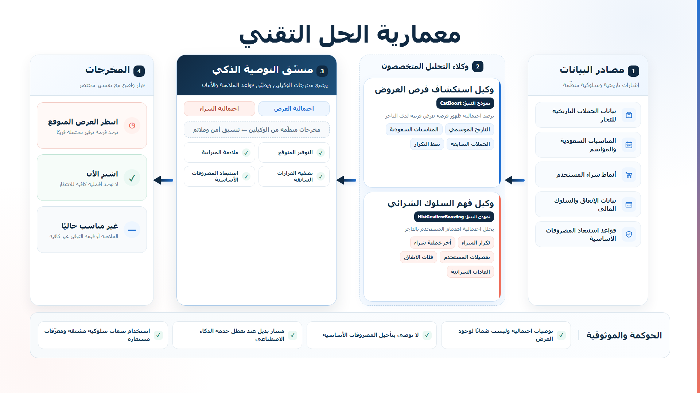

# Namo

> An AI-powered financial companion that turns saving into an engaging, personalized experience.

## The problem

Traditional banking applications show balances, charts, and transactions, but they provide little immediate emotional motivation for users to save consistently. Spending creates instant gratification, while the reward from saving is usually delayed.

## Our solution

Namo introduces Saqr, a virtual financial companion whose health, mood, and evolution respond to the user's financial behavior.

Saving supports Saqr's growth. Overspending can affect his health. Legitimate emergency withdrawals are protected through a compassionate emergency-shield mechanism, so users are not unfairly punished.

The experience combines:

- Personalized savings opportunities.
- Family savings goals.
- Gamification and rewards.
- AI-assisted financial guidance.
- Adaptive pet progression.
- Responsible emergency safeguards.

## Why it matters

Namo transforms financial discipline from a passive tracking experience into an interactive habit-building journey. It is designed to help banks increase engagement, encourage saving behavior, and create a stronger emotional connection with customers.

> Namo is a hackathon prototype built with SYNTHETIC and MOCK data. It is not a production banking application and does not use real customer financial data.

## What judges can experience

- A responsive Arabic-first customer application.
- A virtual companion that reacts to real-time financial behavior.
- Personal and family savings journeys.
- AI-powered model recommendations or deterministic fallback saving opportunities.
- Distinct NXP, loyalty-point, and cashback reward systems.
- Emergency protection that avoids punishing genuine withdrawals.
- Real-time notifications and parent-to-child family rewards.
- A controlled demo environment with instant reset support.

## Key innovation

Namo does not simply add badges to a banking interface. It connects financial behavior to an evolving emotional companion. The user receives immediate visual and emotional feedback for decisions whose financial benefits would normally be delayed.

The product combines four ideas:

- Relative progress based on each user's personal savings goal.
- Compassionate handling of legitimate emergency withdrawals.
- Reliable recommendations through predictive ML with deterministic fallback.
- Clear separation between personal savings, family savings, rewards, and merchant opportunities.

## Suggested demo flow

1. Open the customer application.
2. Activate the savings journey.
3. Set or update the personal savings goal.
4. Add savings and observe Saqr's health and evolution.
5. Open Saving Opportunities and generate a personalized recommendation.
6. Continue to the family goal and generate a contribution plan.
7. Settle the merchant opportunity through the Cheat Controller.
8. Switch to the parent account and reward the child.
9. Return to the child account to show the notification and celebration.

## Product screenshots

| Home and savings | Saqr progression | Family savings | Saving opportunities |
| --- | --- | --- | --- |
| Add screenshot | Add screenshot | Add screenshot | Add screenshot |

## Architecture

```text
React customer app ---- HTTP ----> Express backend ----> Firebase Realtime Database
        ^                              |
        |                              +---- optional ----> FastAPI ML service
        |                                                   |-- CatBoost offer model
        +---------- live Firebase state --------------------+-- HistGradientBoosting purchase model
```

Express owns application and business orchestration. Firebase Realtime Database is the demo-state source of truth. The React frontend sends actions to Express and listens for live state updates from Firebase.

The optional FastAPI service calculates predictive recommendation signals. Express uses a deterministic fallback if that service is disabled, unavailable, or slow. Google Gemini may generate companion reaction text when configured, but it does not calculate probabilities or recommendations.



Technical references:

- [Current architecture](docs/CURRENT_ARCHITECTURE.md)
- [API reference](docs/API.md)
- [Firebase data model](docs/DATA_MODEL.md)
- [AI implementation plan](docs/AI_IMPLEMENTATION_PLAN.md)
- [ML model card](ml-service/MODEL_CARD.md)

## Technology stack

| Layer | Technology |
| --- | --- |
| Frontend | React, Vite, CSS |
| Backend | Node.js, Express |
| Live data | Firebase Realtime Database |
| ML service | FastAPI, CatBoost, HistGradientBoosting |
| Optional generative AI | Google Gemini |
| Testing | Node test suites, frontend regression tests, Playwright |
| Demo environment | Firebase Emulator Suite |

PyTorch is used only for optional deep-learning benchmarks. It is not required for normal application startup.

## Repository structure

```text
Amad/
|-- frontend/                 React customer application
|-- backend/                  Express API and Firebase integration
|-- ml-service/               Optional FastAPI prediction service
|-- cheat-controller/         Demo operator interface
|-- visual-design/            Offline architecture visuals
|-- ml-results-showcase/      Offline ML results dashboard
|-- docs/                     Architecture, API, and data documentation
|-- run-project.bat           One-click Windows launcher
`-- firebase.json             Local emulator configuration
```

Additional guides:

- [ML service setup](ml-service/README.md)
- [Technical visual guide](visual-design/README.md)
- [ML results showcase](ml-results-showcase/README.md)

## Quick start

### Prerequisites

- Node.js and npm.
- Java for the Firebase Emulator Suite.
- Firebase CLI, or permission for the launcher to install it.
- Python only when the optional ML service will be used.

For the fastest demo setup on Windows:

1. Clone or open the repository root.
2. Double-click `run-project.bat`.
3. Keep the service terminal windows open.
4. Use the customer application and Cheat Controller URLs printed by the launcher.

The core application remains functional without Python through the deterministic recommendation fallback.

## One-click Windows launch

Double-click `run-project.bat` from the repository root. The launcher:

- Finds an available local Java runtime.
- Installs Firebase CLI if needed.
- Installs missing frontend and backend dependencies.
- Creates `backend/.env` from `backend/.env.example` when needed.
- Starts the Firebase Realtime Database emulator.
- Verifies the optional Python runtime and local model artifacts.
- Seeds the demo state.
- Starts Express, the Cheat Controller, and the React application.
- Opens the customer and operator browser tabs.

The launcher prints the selected ports and chooses alternatives if defaults are busy. If FastAPI or its generated artifacts are unavailable, the rest of the demo still starts with deterministic fallback behavior.

Generated datasets and model binaries stay local and are intentionally ignored by Git.

## Demo operator controls

The Cheat Controller is served by the backend. With the default manual setup, open `http://localhost:3000/`.

It supports:

- Updating the personal savings goal.
- Depositing a salary with an editable auto-save percentage.
- Adding instant savings.
- Simulating in-budget and over-budget purchases.
- Triggering a protected emergency withdrawal.
- Inspecting whether recommendations came from ML or fallback logic.
- Settling the staged merchant opportunity.
- Resetting the complete demo journey in about one second.

The controller exposes technical diagnostics that are intentionally hidden from the customer interface.

### Canonical demo values

| Moment | Values |
| --- | --- |
| Initial state | Family SAR 3,600 of SAR 12,000; Rashid contributed SAR 300; NXP 60; Akthr 120 |
| Contribution plan | Parent 1: SAR 700; Parent 2: SAR 400; Rashid: SAR 100; monthly requirement: SAR 1,200 |
| Prediction | Half Million; 72%; 3-day window; estimated saving SAR 15; Saudi National Day scenario |
| After settlement | Family SAR 3,615; Rashid SAR 315; NXP 70; Akthr remains 120 |
| After family reward | Akthr 145; sender is the parent role; recipient is Rashid |

Reward types remain separate:

- NXP is the virtual in-app currency.
- Akthr points represent a MOCK loyalty campaign.
- Cashback is limited to campaign-funded demo rewards.

## Manual local setup

### Localhost

Use three terminals from the repository root.

**1. Firebase Realtime Database emulator**

```powershell
npm install -g firebase-tools
firebase emulators:start --only database
```

**2. Express backend and Cheat Controller**

```powershell
cd backend
Copy-Item .env.example .env
npm install
npm run seed
npm run dev
```

**3. React frontend**

```powershell
cd frontend
npm install
npm run dev -- --host 127.0.0.1 --port 5173
```

Default local URLs:

- Customer application: `http://localhost:5173/`
- Cheat Controller: `http://localhost:3000/`
- Firebase Emulator UI: `http://localhost:4000/`

### Optional ML service

The application works without this service. To generate local artifacts and start FastAPI:

```powershell
cd ml-service
python -m venv .venv
.\.venv\Scripts\python.exe -m pip install -r requirements.txt
.\.venv\Scripts\python.exe -m scripts.generate_demo_data
.\.venv\Scripts\python.exe -m scripts.train_models
.\.venv\Scripts\python.exe -m scripts.evaluate_models
.\.venv\Scripts\python.exe -m uvicorn app.main:app --port 8001
```

Configure `backend/.env` before starting Express:

```env
USE_ML_SERVICE=true
ML_SERVICE_URL=http://127.0.0.1:8001
ML_SERVICE_TIMEOUT_MS=1500
```

### LAN access

Use the same emulator and backend setup, then set the emulator host in `backend/.env`:

```env
FIREBASE_DATABASE_EMULATOR_HOST=LAN_IP:9000
```

Start the frontend with LAN-accessible values:

```powershell
cd frontend
$env:VITE_FIREBASE_EMULATOR_HOST="LAN_IP:9000"
$env:VITE_API_BASE_URL="http://LAN_IP:3000"
npm run dev -- --host 0.0.0.0 --port 5173
```

Replace `LAN_IP` with the host machine's local network address.

## ML and fallback behavior

Namo uses two analytical models and a recommendation coordinator:

1. The Offer Opportunity Agent uses CatBoost to estimate whether a merchant offer may appear soon.
2. The Purchase Behavior Agent uses HistGradientBoosting to estimate whether a user may purchase from that merchant soon.
3. The coordinator combines both probabilities with estimated savings, budget relevance, essential-category suppression, and previous decisions.

Tabular and deep-learning candidates were benchmarked. The neural candidates were not selected because they did not provide enough improvement to justify their additional runtime and training cost. Detailed evidence is available in the [model card](ml-service/MODEL_CARD.md).

If FastAPI is disabled, unavailable, invalid, or too slow, Express returns a labeled deterministic fallback recommendation. The customer journey therefore remains usable without Python or model binaries.

Google Gemini is optional. It may generate short companion reactions, while ML models or deterministic business logic calculate recommendations. No predicted promotion is guaranteed.

## Data disclosure

All current model and merchant-campaign data is MOCK or SYNTHETIC Saudi-market prototype data. Named merchant histories are fictional examples and are not factual campaign claims.

The generated ML dataset contains:

- 20 Saudi-market merchants.
- 220 fictional users.
- 2,047 SYNTHETIC campaigns.
- 95,063 SYNTHETIC transactions.

These figures describe the generated prototype dataset and do not represent real customer activity. The repository contains no real account numbers, IBANs, card details, raw banking descriptions, or personal banking transactions.

Demo identifiers are pseudonymous. A real deployment would require consent, governance, verified campaign data, calibration, monitoring, and drift detection.

## Verification status

- Frontend tests: 46/46 passed.
- Backend tests: 40/40 passed.
- Route tests: 4/4 passed.
- ML tests: 21/21 passed.
- Responsive validation: 390×844 and 1280×900.
- Accessibility validation: keyboard navigation, dialog focus management, and reduced-motion support.
- Frontend dependency audit: 0 vulnerabilities.

Run the main checks from the repository root:

```powershell
npm --prefix frontend run build
npm --prefix frontend test
npm --prefix backend test
npm --prefix backend run test:routes
ml-service\.venv\Scripts\python.exe -m pytest
```

Backend route tests require the backend and Firebase emulator to be running. ML tests that load trained models require locally generated artifacts.

Technical note: the backend production-dependency audit currently reports eight moderate transitive `uuid` advisories through the existing Firebase Admin dependency chain. The complete available fix requires a breaking major dependency upgrade.

## Known limitations

- Namo is a hackathon prototype, not a production banking application.
- The demo uses one local tenant without production authentication or authorization.
- Model results come from SYNTHETIC data and do not represent production performance.
- Offer prediction is probabilistic and cannot guarantee a future promotion.
- Model binaries and complete generated datasets must be created locally.
- Firebase runs through the local emulator in the documented demo setup.
- Notifications and reward settlement are demo-scoped.
- Pet evolution responds to personal savings only. Family contributions can encourage Saqr but do not change his growth stage.
- A real deployment would require consented transaction features, verified campaigns, security review, governance, monitoring, and operational controls.

## Troubleshooting

| Symptom | Resolution |
| --- | --- |
| Frontend is blank or stale | Restart the frontend, then hard-refresh the browser with `Ctrl+Shift+R`. |
| Backend health check fails | Restart `npm run dev` from `backend/`. Firebase state remains in the emulator. |
| Emulator state is inconsistent | Use the full reset action in the Cheat Controller or run `curl -X POST http://localhost:3000/api/reset`. |
| ML status shows fallback | Check the fallback reason in the Cheat Controller. Verify FastAPI on port 8001 and the ML values in `backend/.env` when live ML is required. |
| Offer remains in the waiting state | Settle the Half Million opportunity from the Cheat Controller, or reset and replay the journey. |
| A family reward is already sent | Duplicate rewards are rejected by design. Reset before replaying that demo step. |
| Browser role or notices appear stale | Run `localStorage.clear()` in DevTools and refresh, or use the full reset action. |
| The presenter needs a fast recovery | Reset from the Cheat Controller, refresh the customer application, and restart from the Home activation card. |

The full reset restores the customer application to Home, clears predictions and decisions, removes mutable rewards and pet changes, resets notifications and role state, and returns the journey to its canonical demo values.
