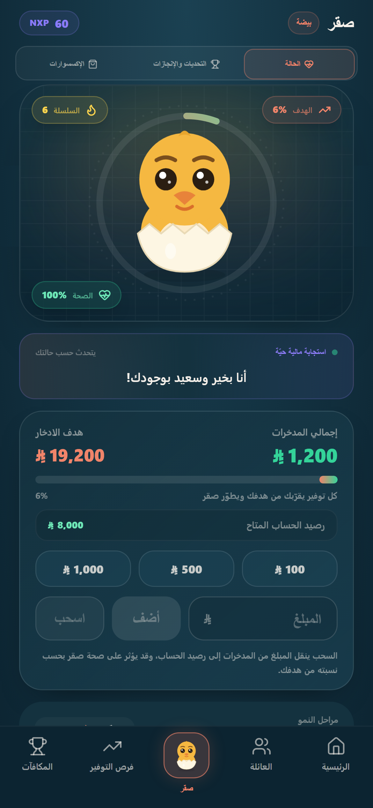
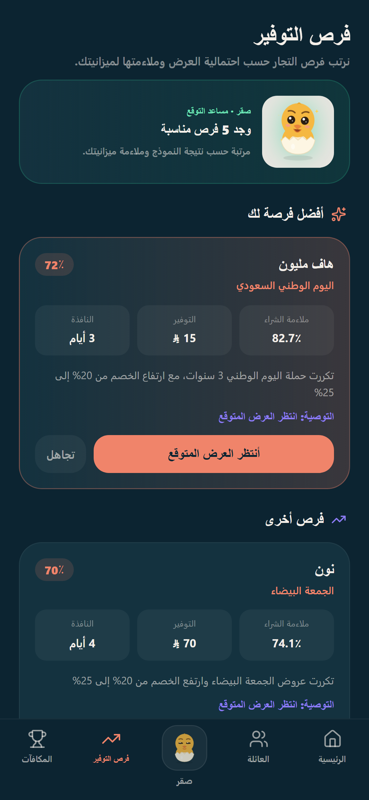
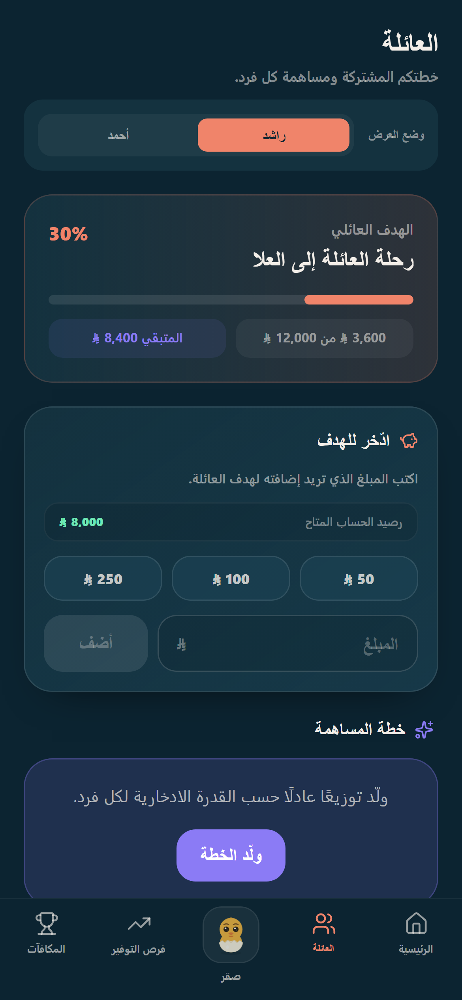
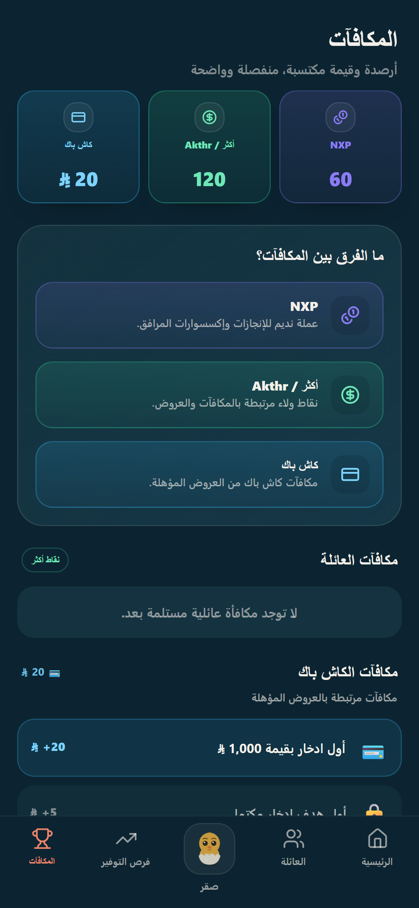

<p align="center">
  
</p>

<h1 align="center">Nadeem — نديم</h1>

---

<p align="center">
  A proactive, personalized financial companion for better saving and spending decisions.
</p>

<p align="center">
  
  
  
  
</p>

Nadeem by **Pixel Falcons** explores how personal finance can become more
timely, understandable, and engaging. It combines
budget planning, family saving, financial gamification, and probabilistic
merchant-opportunity recommendations in one Arabic-first experience.

This repository is an engineering case study, not a production banking
application. All current financial activity and model training data is clearly
labeled **MOCK / SYNTHETIC** and represents fictional Saudi-market scenarios.

## Product Overview

Most financial applications explain spending after it happens. Nadeem focuses
on the moment before the next decision:

- Can the user save more this month?
- Is a possible merchant opportunity relevant to their real behavior?
- Would waiting help, or is buying now the better action?
- How can a family make progress toward one shared goal?

Nadeem turns those questions into a guided customer journey instead of another
passive dashboard.

## Key Features

### Personal saving and budgeting

- Income-based saving-plan suggestions
- Editable monthly targets and category budgets
- Automatic tracking of saving progress
- Emergency-withdrawal protection

### Saqr financial companion

Saqr (صقر) reflects positive financial behavior through health, mood,
progression, streaks, and accessible celebration states. The companion begins
in its egg stage and evolves only through actual saving progress.

### Personalized saving opportunities

Two analytical models evaluate different signals:

1. **Offer Opportunity Agent — CatBoost**
   estimates whether a merchant campaign may appear soon.
2. **Purchase Behavior Agent — HistGradientBoosting**
   estimates whether a user may purchase from that merchant soon.

The Recommendation Coordinator combines both probabilities with estimated
saving, budget relevance, essential-category safeguards, and previous user
decisions. It returns one understandable action: **wait**, **buy now**, or
**not relevant**.

Predictions are probabilistic. Nadeem never guarantees that a future promotion
will occur.

### Family saving

- Shared family goals and progress
- Explainable contribution planning
- Individual contribution history
- Parent-to-child encouragement and rewards

### Separate reward systems

- **NXP:** virtual in-app progression currency
- **Akthr:** loyalty-style reward points
- **Cashback:** campaign-funded monetary rewards

These balances remain separate throughout the application.

### Reliable fallback

The React and Node application continues to work when the Python ML service is
unavailable. The backend validates ML responses and switches to deterministic,
labeled fallback guidance on timeout, invalid output, low confidence, or
service failure.

## Product Screens

<table>
  <tr>
    <td align="center"></td>
    <td align="center"></td>
    <td align="center"></td>
    <td align="center"></td>
    <td align="center"></td>
  </tr>
  <tr>
    <td align="center"><strong>Home</strong></td>
    <td align="center"><strong>Saqr</strong></td>
    <td align="center"><strong>Saving opportunities</strong></td>
    <td align="center"><strong>Family saving</strong></td>
    <td align="center"><strong>Rewards</strong></td>
  </tr>
</table>

## Architecture

```text
Arabic React application
          │
          ▼
Node.js / Express application services
     │                         │
     ▼                         ▼
Firebase Realtime DB     Recommendation adapter
                               │
                    ┌──────────┴──────────┐
                    ▼                     ▼
             FastAPI ML service   Deterministic fallback
                    │
          ┌─────────┴─────────┐
          ▼                   ▼
       CatBoost      HistGradientBoosting
          └─────────┬─────────┘
                    ▼
        Personalized recommendation
```

The backend owns financial calculations, rewards, family workflows, and state
changes. Firebase keeps customer screens synchronized. The optional FastAPI
service is stateless with respect to Firebase and receives only pseudonymous
identifiers and derived behavioral features.

## Model Selection

Traditional tabular models and optional neural candidates were evaluated under
the same chronological protocol. The benchmark included logistic regression,
tree ensembles, CatBoost, embedding MLPs, and a GRU.

- CatBoost was selected for offer opportunity prediction.
- HistGradientBoosting remained selected for purchase behavior.
- Neural candidates were not selected because they did not provide enough
  improvement to justify their additional complexity and training cost.

Selection considered F1, balanced accuracy, calibration, latency, artifact
size, and training cost. Exact results and limitations remain in the
[model card](ml-service/MODEL_CARD.md).

## Data and Safety

All current datasets are **MOCK / SYNTHETIC — SAUDI MARKET**.

- No real customer banking data is included.
- No real account numbers, IBANs, card details, or raw banking descriptions are
  stored in the repository.
- Merchant campaign histories are fictional examples, not factual claims.
- User identifiers are pseudonymous.
- Essential purchases are suppressed from delay recommendations.
- An LLM may explain a prediction but never calculates its probability.

Real deployment would require consented transaction features, verified campaign
history, authentication and authorization, governance, monitoring,
recalibration, and drift detection.

## Technology Stack

| Area | Technologies |
| --- | --- |
| Frontend | React, Vite, Tailwind CSS, Motion |
| Backend | Node.js, Express |
| State | Firebase Realtime Database emulator |
| ML service | Python, FastAPI, scikit-learn, CatBoost |
| Data | pandas, NumPy, joblib |
| Optional benchmark | PyTorch |
| Testing | Node test runner, pytest |

PyTorch is used only for optional benchmark experiments and is not required for
normal application startup.

## Repository Structure

```text
Amad/
├── frontend/        Arabic React customer application
├── backend/         Express API, financial engines, and Firebase integration
├── ml-service/      FastAPI prediction service and reproducible ML pipeline
├── shared/          Shared domain constants and identity rules
├── docs/            Architecture, API, and data-model documentation
├── scripts/         Local development launcher
└── run-project.bat  One-click Windows startup
```

## Quick Start

### Prerequisites

- Node.js and npm
- Java 17 or newer
- Firebase CLI
- Python 3.10–3.13 only when using the optional ML service

### One-click Windows startup

From the repository root:

```powershell
.\run-project.bat
```

The launcher starts the Firebase emulator, seeds isolated local data, starts
the API and frontend, and uses the deterministic recommendation fallback when
local model artifacts are unavailable.

### Manual startup

Install the Firebase CLI once:

```powershell
npm install -g firebase-tools
```

Start the Realtime Database emulator:

```powershell
firebase emulators:start --only database --project amad-demo
```

In a second terminal, start the backend:

```powershell
cd backend
Copy-Item .env.example .env
npm install
npm run seed
npm run dev
```

In a third terminal, start the frontend:

```powershell
cd frontend
npm install
npm run dev
```

Default local addresses:

- Frontend: `http://127.0.0.1:5173`
- API: `http://127.0.0.1:3000`
- API health: `http://127.0.0.1:3000/health`
- Firebase Emulator UI: `http://127.0.0.1:4000`

## Optional ML Service

From `ml-service`:

```powershell
python -m venv .venv
.\.venv\Scripts\python.exe -m pip install -r requirements.txt
.\.venv\Scripts\python.exe -m scripts.generate_demo_data
.\.venv\Scripts\python.exe -m scripts.train_models
.\.venv\Scripts\python.exe -m scripts.evaluate_models
.\.venv\Scripts\python.exe -m uvicorn app.main:app --port 8001
```

Configure the backend:

```env
USE_ML_SERVICE=true
ML_SERVICE_URL=http://127.0.0.1:8001
ML_SERVICE_TIMEOUT_MS=1500
```

Generated full datasets and fitted model binaries are intentionally ignored by
Git. Small schema-preserving samples and evaluation metadata remain tracked.

## Testing

Frontend:

```powershell
npm --prefix frontend test
npm --prefix frontend run build
```

Backend:

```powershell
npm --prefix backend test
npm --prefix backend run test:routes
```

Route tests require the Firebase emulator and backend to be running.

ML:

```powershell
ml-service\.venv\Scripts\python.exe -m pytest ml-service
```

Tests that load trained estimators require locally generated model artifacts.

## Documentation

- [Current architecture](docs/CURRENT_ARCHITECTURE.md)
- [Backend API](docs/API.md)
- [Firebase data model](docs/DATA_MODEL.md)
- [AI implementation notes](docs/AI_IMPLEMENTATION_PLAN.md)
- [ML service guide](ml-service/README.md)
- [Model card](ml-service/MODEL_CARD.md)

## Current Limitations

- Model results use synthetic data and are not production performance.
- Merchant opportunities remain stochastic and cannot be guaranteed.
- Model binaries must be generated locally.
- The repository has no production banking integration.
- Authentication and authorization are not production-ready.
- Real deployment requires verified campaign data and consented behavioral
  features.
